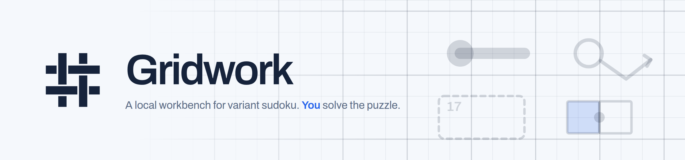

<picture>
  <source media="(prefers-color-scheme: dark)" srcset="assets/brand/header-dark.png">
  
</picture>

# Gridwork

A local desktop app for **solving** variant sudoku puzzles you find online. Paste a
SudokuPad or f-puzzles link, and Gridwork loads the board and hands you the tools to
work it yourself.

### The one hard rule

**Gridwork never solves a puzzle for you.** That's the whole design, not a missing
feature:

- Hints name a *technique* and point at cells. For a placement technique they
  deliberately don't tell you the digit.
- Auto-candidates show what the classic rules still allow. They're display-only and
  never write into the grid.
- The puzzle's solution is used for win detection and is never shown.

Anything that would hand over an answer is out of scope, however convenient.

## What it does

**Import.** Paste a SudokuPad link, an f-puzzles.com link, a bare puzzle ID, or raw
f-puzzles JSON. Fetching happens in the Electron main process, so there's no CORS
workaround to babysit. Recently opened puzzles are kept in a history list.

**Solve.** Digit entry, corner and centre pencil marks, multi-cell selection (drag,
Ctrl+click, Shift+click for a rectangle, Ctrl+A), and live conflict highlighting.
Every action — digits, pencil marks, deletion, colouring — applies to the whole
selection at once.

**Assist without spoiling.** A pausable timer, undo/redo that covers pencil marks and
highlight colours, six colours of your own cell highlighting, technique hints,
save-and-resume, zoom, a toggle between live mistake-checking and check-on-demand,
and keyboard shortcuts for all of it.

**Look right.** Six themes — cool, warm and nebula, each in light and dark.

## Variant coverage

**Checked** — placing a digit that breaks one of these lights up red, same as a
row/column conflict:

> killer cages · thermometers · arrows · kropki dots · odd/even cells ·
> renban, whisper and palindrome lines · between lines · little killer sums ·
> XV pairs · sandwich sums · extra regions · clones · quadruples · min/max cells ·
> anti-knight · anti-king · diagonals · non-consecutive

**Drawn but not checked.** SudokuPad's native format describes its markings as
*drawing* instructions with no semantic tagging — a line is just a line, with no
statement of what rule it carries. Gridwork draws them faithfully and shows the
puzzle's written rules above the board so you can apply them yourself, rather than
guessing at a rule and checking the wrong thing.

**Not supported yet.** Jigsaw (irregular) regions load with a notice that only rows
and columns are being checked. Region-sum lines, indexer clues, X-sum and skyscraper
clues, some exotic line types (entropic, modular, nabner, zipper, double-arrow,
slow-thermo) and negative constraints aren't implemented.

## Running it

```bash
npm install
npm run dev        # Electron window + renderer dev server
npm run build      # production build into out/
npm test           # typecheck + all six smoke suites
```

Individual suites: `test:importer`, `test:scl`, `test:validate`, `test:phase4`,
`test:selection`, `test:board`. There's no test framework — each suite is plain
`tsx` with a hand-rolled `check()`. TypeScript strict is on and the codebase
compiles clean.

Packaging into a real installer hasn't been done yet; today it runs from source.

## Layout

```
src/main/         Electron main: window, IPC (network fetch, window controls)
src/preload/      contextBridge -> window.api. The renderer's only privileged door.
src/renderer/src/
  importer/       paste -> PuzzleModel (fpuzzles, scl, PuzzleZipper)
  model/types.ts  PuzzleModel + the Constraint union
  solver/         validate.ts, candidates.ts, hints.ts. No auto-solving.
  state/          selection, history (undo), timer, persistence
  render/board.ts the interactive SVG board
  ui/             icons, settings modal
scripts/          smoke tests, one per area, plus real payload fixtures
assets/brand/     the Gridwork mark, its alternates, and the README header
```

## Docs

- `CLAUDE.md` — conventions and invariants. Read before writing code here.
- `design.md` — the deep technical reference, including the reverse-engineered
  format notes.
- `phase-status.md` — plain-language progress summary.
- `audit-2026-08-31.md` — known open issues.
- `assets/brand/README.md` — the mark, the alternates it was chosen from, and the
  brief any new mark has to satisfy.
